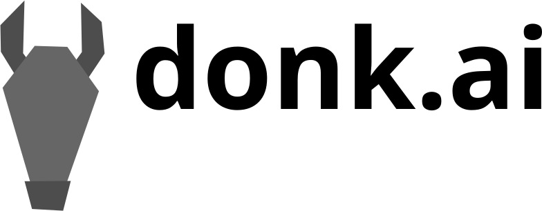

[](https://github.com/DiddiZ/donk.ai/actions/workflows/python-package.yml)

<div align="center">
  
</div>

# Guided Policy Search Toolbox
This repository provides an implementation of the Guided Policy Search (GPS) algorithm for trajectroy-centric Reinforcement Learning.
The 


## Guided Policy Search
TODO

## Features

### LQR
The linear–quadratic regulator (LQR) computes cost optimal linerar controllers.

```python
from donk.dynamics import linear_dynamics
from donk.samples import StateDistribution
from donk.traj_opt import ILQR

X, U = ... # Samples
cost_function = ... # Define cost function

# Fit dynamics
dyn = linear_dynamics.fit_lr(X, U)
# Quadratic costs
costs = cost_function.quadratic_approximation(np.mean(X, axis=0), np.mean(U, axis=0))
# Initial state distribution
x0 = StateDistribution.fit(X[:, 0])

# Perform LQR trajectory optimization
ilqr = ILQR(dyn, prev_pol, costs, x0)  
pol = ilqr.optimize(kl_step=1).policy # Use a KL constraint of 1
```

### Quadratic Cost Approximation
LQR trajectory optimization requires a quadratic cost function. Donk.ai can automatically compute quadratic approximations using symbolic differentiation via sympy.

```python
from donk.costs import SymbolicCostFunction

def cost_function_(X, U):
    """Define cost function.

    Args:
        X: (T+1, dX) ndarray of symbols for states
        U: (T, dU) ndarray of symbols for action
    """

    # Cost depends on the last three states
    costs = np.sum(X[:, -3:]**2, axis=-1) / 2

    # And some small action costs
    costs[:-1] += 1e-3 * np.sum(U**2, axis=-1) / 2
    return costs

# Wrap into symbolic cost function, which handles symbolic differentation.
cost_function = SymbolicCostFunction(cost_function_, T, dX, dU)

# Quadratic approxmation around a specific trajectory.
cost_approx = cost_function.quadratic_approximation(X, U)
```

As `cost_function_` is called with sympy symbols, 


### TVLG Dynamics
A time-varying linear Gaussian (TVGL) dynamics model `dyn: LinearDynamics`
consists of a linear term `dyn.K`, a constant term `dyn.k` and a covariance `dyn.covar`.
The transitions are modelled as a series of Gaussian distributions
<div align="center">

</div>
where the distribution of next state depends on current state and action.

Linear dynamics models can be fitted with or without a prior distribution.

#### Linear Regression

```python
from donk.dynamics import linear_dynamics

X, U = ... # Samples


dyn = linear_dynamics.fit_lr(X, U, regularization=1e-6)
```

It is important to employ a regularization term when using no prior, as otherwise the resulting covariances might not be symmetric positive definite.

#### Linear Regression with NIW-Prior

```python
from donk.dynamics import linear_dynamics
from donk.dynamics.prior import GMMPrior
from donk.samples import TransitionPool

X, U = ... # Samples
X_prior, U_prior = ... # Data for prior

# Initialize transition pool
transition_pool = TransitionPool()
transitions_pool.add(X_prior, X_prior)
transitions_pool.add(Y, Y) # Also add current sample data

# Update prior
prior = GMMPrior(n_clusters=4)
prior.update(transitions_pool.get_transitions())

# Fit dynamics
dyn = linear_dynamics.fit_lr(X, U, prior=prior)
```

Sufficient size of the prior assumed, regularization of the dynamics is not required.

### Datalogging
Inside into internals and interim results of sub-algorithms is often crucial for understanding and debugging.
Therfore, donk.ai provides a context-based datalogging functionality, using Python shelves.

#### Example

```python
import donk.datalogging as datalogging


def inner_fun(a, b):
    "Inner function with datalogging"
    c = a + b
    datalogging.log(c=c) # Log interim result
    return c**2  

with datalogging.ShelveDataLogger("logfile"):
    a = 1
    b = 2

    datalogging.log(a=a, b=b)

    # Call function within context
    with datalogging.Context("inner_fun"):
        d = inner_fun(a, b)
    datalogging.log(d=d)

    # Call function without context
    inner_fun(a, b)
```

#### Read shelves

The resulting shelve contains the data and can be opened via the shelve library.
```python
import shelve

with shelve.open('logfile') as data:
    for key, value in data.items():
        print(f"{key}: {value}")
```
results in:
```text
a: 1
b: 2
inner_fun/c: 3
d: 9
c: 3
```

## See also
* [Original GPS implmenetion at Berkeley](https://github.com/cbfinn/gps)
